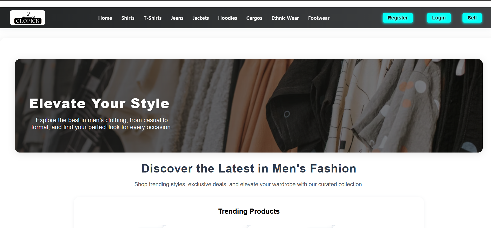

# CLOPICK 👕🛒
MERN Stack E-commerce Clothing Website with OTP-based Customer & Seller Registration.

## 🚀 Live Demo
🔗 [clopick-com.onrender.com](https://clopick-com.onrender.com)

## ✨ Features
- Customer & Seller Registration with OTP (Email & Mobile)
- Firebase OTP & Email/Password login support
- Seller Dashboard
- Personalized Product Recommendations
- Detailed Product Listings with "Buy Now" option
- Amazon-like Product Detail Page

## 🛠️ Tech Stack
- **Frontend:** React, Tailwind CSS  
- **Backend:** Node.js, Express.js  
- **Database:** MongoDB  
- **Authentication:** OTP via Email (Nodemailer)

## 📸 Screenshots
### 🏠 Homepage

## 👨‍💻 Author
**Vidit** - B.Tech CSE Student | MERN Stack Developer  
[LinkedIn](https://www.linkedin.com/in/codevidit/)
